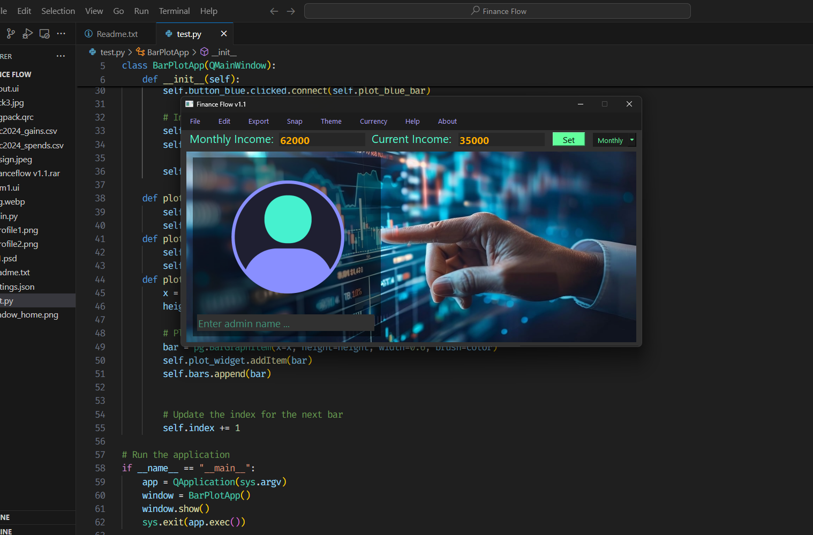
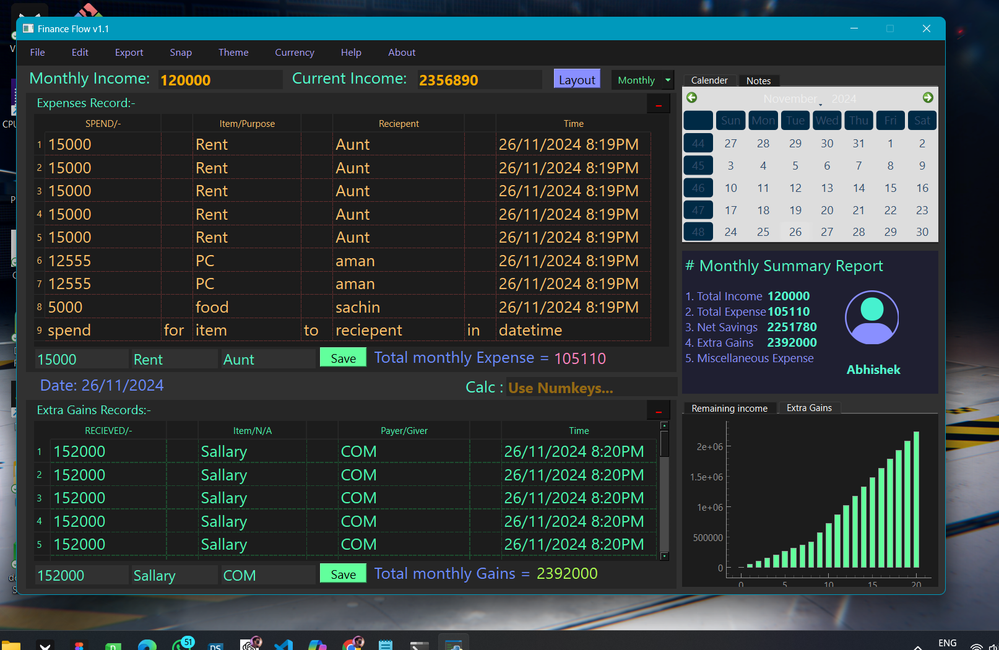
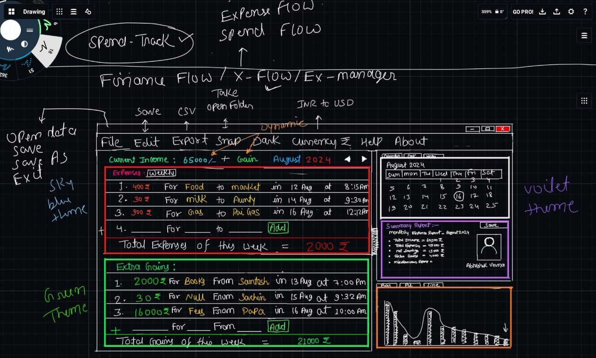

# Finance Flow v1.1:- 

	Finance Flow v1.1 is an Ai powered desktop version app designed to help users to track 	their daily expenses and maintain itemized spending records easily and suggest actions and 	ideas to maintain better savings. Built using the PySide6 GUI framework, this 	application aims to simplify personal finance management.  

	In the future, the project will include AI and machine learning features to predict 	future expenditures and offer money-saving suggestions. 

## Features:-
	- Track daily expenses with ease.  
	- Maintain a record of spending categorized by items.  
	- Simple and user-friendly GUI for better accessibility.  
	- Future enhancements planned: AI-based expenditure prediction and savings 	suggestions.  

### Installation:-

	pip install numpy pandas pyautogui pyqtgraph pyside6==6.7.1
	Running the Application
	To start the application, run: python main.py

Dependencies:-
	Ensure you have Python installed (version 3.10 or higher recommended). 
	The project uses the following Python modules:

	json: Built-in module for handling data.
	numpy: For numerical operations.
	pandas: For data manipulation.
	pyautogui: Used for capturing screenshots.
	pyqtgraph: For plotting graphs.
	pyside6 (version 6.7.1): GUI framework for creating the application interface.

License:-

	This project is licensed under the Custom License:

	You are free to use this project for personal or educational purposes.
	Redistribution, sale, or uploading this project to any platform without the author’s 	explicit permission is strictly prohibited.

Contributing:-

	Contributions are welcome! Please fork the repository and create a pull request to 	propose improvements or bug fixes.

	Future Enhancements
	Integration of AI and machine learning techniques for:
	Predicting future expenditures.
	Providing money-saving suggestions.
